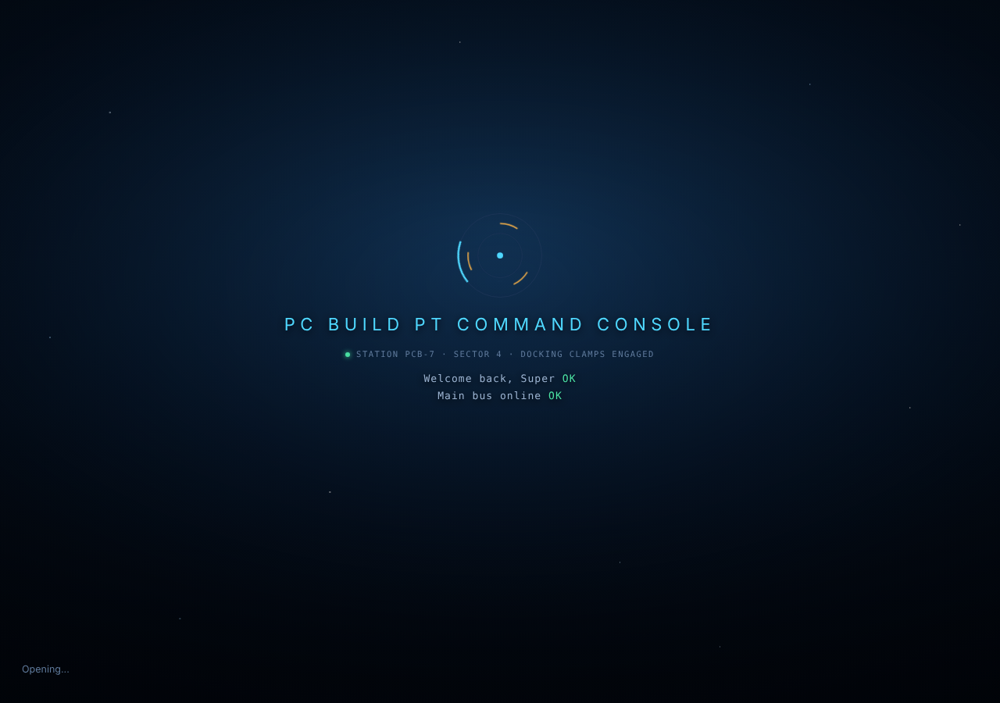
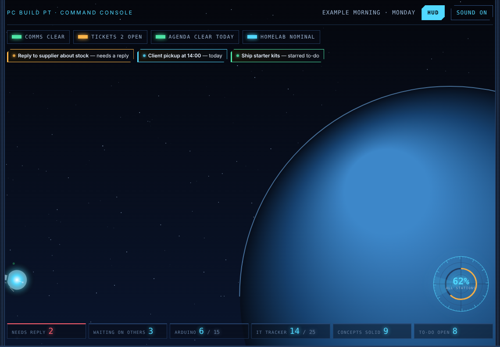
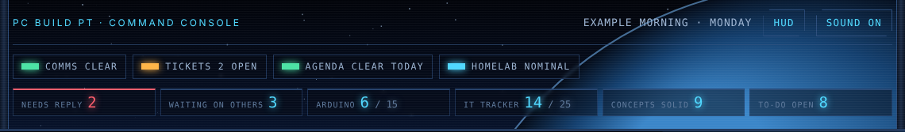
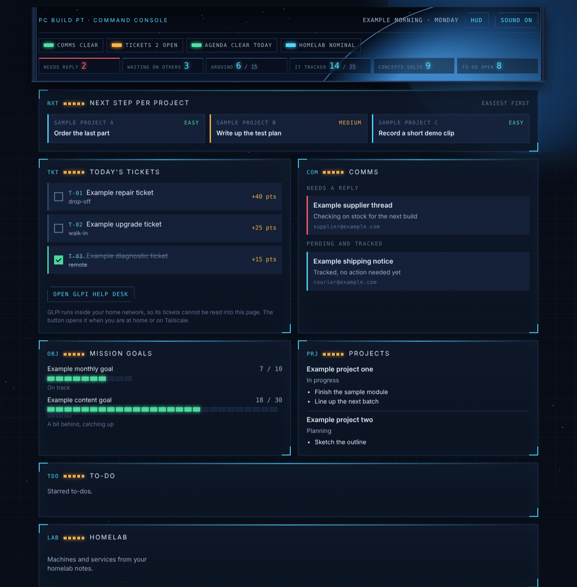

# Command Console

A sci-fi, spaceship-bridge styled personal dashboard. One self-contained HTML file: a boot sequence, a cockpit window with stars, a planet and passing ships, a HUD you can open and close, and every sound effect generated on the fly, no audio files anywhere.

Originally built for PC Build PT by SuperDidZero, through a long back-and-forth with Claude describing changes in plain English. This is that file, with everything personal stripped out, so anyone can fork it and make it theirs.






All four screenshots use placeholder example data, not anyone's real tickets or inbox.

## What this actually is

It's one file, `index.html`. Open it in a browser and you get the full boot sequence, the ship animations, the sounds, the HUD opening and closing. Every tile will be empty, because nothing is feeding it data yet, that's the part that's supposed to be yours.

The whole page reads from a single JavaScript object, `state.today`, and one function, `render()`, turns that object into everything on screen. Nothing else in the file needs to change for you to make this show your own stuff.

## Two ways to fill it in

**If you don't code:** open `index.html` in a Claude conversation (claude.ai, the desktop app, or Claude Code) and describe what you want tracked, tickets, a to-do list, a habit tracker, whatever. Claude can read the `render()` function, see the shape it expects, and wire it up for you the same way this was built in the first place.

**If you do code:** `render()` lives around line 824 and is the entire data contract. It's plain, readable JavaScript, no framework, no build step. Here's a minimal working `state.today` to start from:

```js
state.today = {
  date: "2026-10-05",
  dateLabel: "Monday, Oct 5",
  directive: { title: "Ship the thing", why: "it's been sitting for a week" },
  needsReply: [
    { id: "r1", title: "Example thread", from: "someone@example.com", gist: "Needs a yes or no", url: null }
  ],
  tickets: [],
  quests: [
    { id: "t1", title: "Example task", xp: 25 }
  ],
  goals: [
    { label: "Example goal", target: 10, value: 4, note: "On track" }
  ],
  projects: [
    { name: "Example project", status: "In progress", tasks: ["Do the next thing"], next: "Do the next thing", ease: "Easy" }
  ],
  todo: { starred: ["Example starred item"], groups: [{ name: "Later", items: ["Example item"] }] },
  homelab: { facts: ["3 machines"], machines: [{ name: "example-box", address: "192.168.1.10", role: "server" }] },
  agenda: [],
  tomorrow: [],
  tracker: [{ n: 1, title: "Example skill", done: false }],
  arduino: { items: [{ n: 1, title: "Example kit project" }] },
  fyi: "",
  stats: { trackerDone: 0, trackerTotal: 25, todoOpen: 1, todoDone: 0, todoStarred: 1 }
};
render();
```

Call `render()` again any time `state.today` changes. Where that object comes from is entirely up to you, a JSON file, your own backend, `localStorage`, hardcoded, it doesn't matter to this file.

## The `window.claude` parts

A few features (`window.claude.use("db")`, `.use("mcp")`, `.use("sample")`) only exist when this page runs as a Claude artifact. Every one of them is already wrapped in a check for whether `window.claude` exists, so outside Claude they just quietly do nothing, the rest of the page works exactly the same. You can delete them if you don't want them, or leave them as an example of the pattern.

Two things in there are placeholders on purpose and need your own values before they'll do anything: `QUIZ_TRIGGER_ID` (a scheduled task id, only matters if you want the "start a quiz" style button) and the prompt text inside `reviseDraft()` (only matters if you want the live draft-revision feature; swap in your own name and writing style).

## Sound

Every sound in the file is synthesized from raw oscillators and filtered noise, Web Audio API only, nothing downloaded. Look for the `sfx` object and the functions above it (`tone`, `sweep`, `noise`, `clunk`, and so on) if you want to retune anything or add your own.

## License

MIT. Do whatever you want with it.
